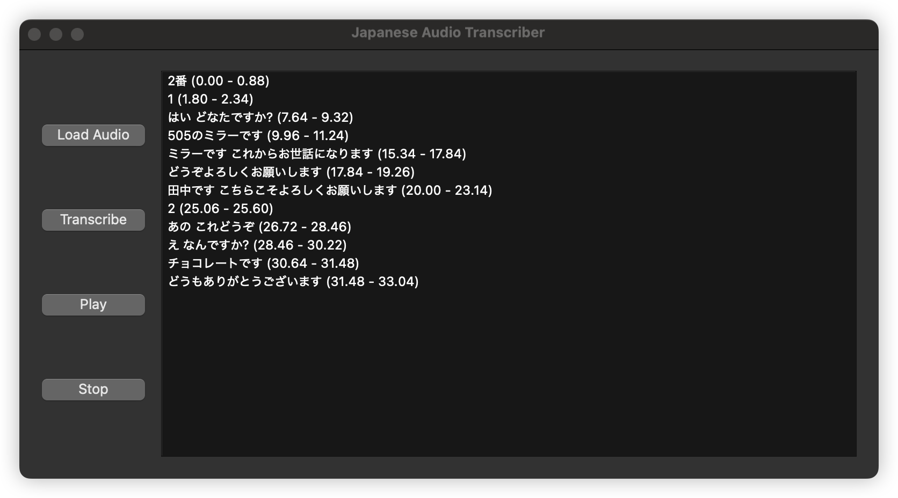

# Japanese Audio Transcription App

A Python desktop application for **Japanese audio transcription** using [Whisper](https://github.com/openai/whisper), with an interactive UI for playback and sentence navigation. Perfect for language learners who want to study audio with timestamps.


## Features

* Load any Japanese audio file (`.mp3`, `.wav`).
* Transcribe audio into sentences with timestamps using Whisper.
* Play and stop audio.
* Click on sentences to jump to the corresponding point in the audio.
* Status updates for model loading and transcription progress.
* Safe on macOS with PyTorch + multiprocessing.

## Screenshots



## Installation

1. Clone the repository:

```bash
git clone https://github.com/chuongmep/japanese-audio-transcriber.git
cd japanese-audio-transcriber
```

2. Create a virtual environment and activate it:

```bash
python -m venv venv
source venv/bin/activate   # macOS/Linux
venv\Scripts\activate      # Windows
```

3. Install dependencies:

```bash
pip install -r requirements.txt
```

> `requirements.txt` should include at least:
>
> ```
> PySide6
> whisper
> torch
> pydub
> simpleaudio
> ```

4. (macOS only) Make sure `ffmpeg` is installed for audio processing:

```bash
brew install ffmpeg
```

## Usage

Run the application:

```bash
python main.py
```

1. Click **Load Audio** to select a Japanese audio file.
2. Click **Transcribe** to generate sentences with timestamps.
3. Use **Play** / **Stop** to listen to the audio.
4. Click on any sentence on the right panel to jump to that point in the audio.

## Notes

* Whisper automatically uses the best model available. The current version uses `small`. You can change to `medium` or `large` for higher accuracy.
* The application uses a separate thread for transcription to prevent crashes on macOS with PyTorch.
* For large audio files, transcription may take several minutes.

## Contributing

Contributions are welcome! You can improve:

* Word-level clickable transcription.
* Support for other languages.
* Export transcripts to CSV or SRT format.
* UI enhancements.

## License

MIT License – see `LICENSE` file.


## Issues 

- Whisper TypeError: argument of type 'NoneType' is not iterable
```bash
pip install git+https://github.com/openai/whisper.git
```